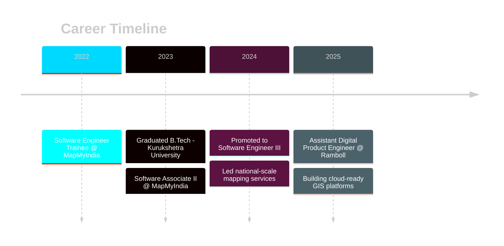
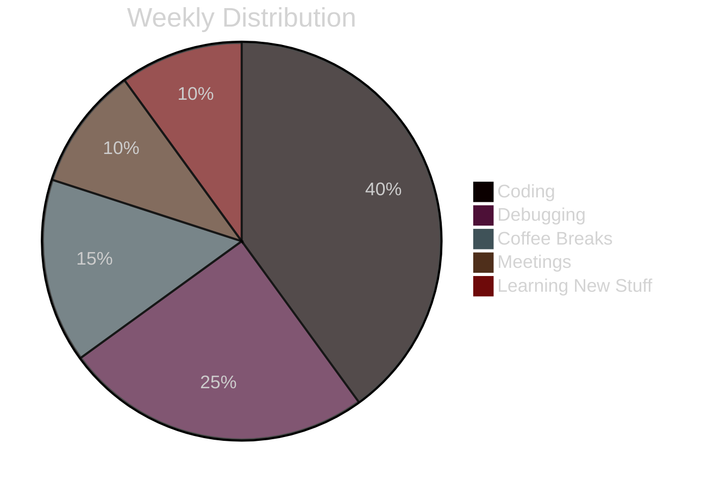

<div align="center">

# 🗺️ Parshant Balwaria

### GIS Software Engineer | Spatial Data Architect | Open Source Contributor


[](https://parshant-balwaria.github.io/portfolio/)
[](https://www.linkedin.com/in/parshant-balwaria-b930a21b9/)
[](mailto:parshantbalwaria@gmail.com)


</div>

---


### 👨‍💻 About Me

```typescript
const parshant = {
    location: "Gurgaon, Cyber City - Building 5 🏢",
    role: "GIS Software Engineer @ Ramboll",
    experience: "2+ years",
    expertise: ["Geospatial Analysis", "Full-Stack Development", "Cloud Architecture"],
    
    currentFocus: {
        building: "Cloud-native GIS platforms",
        automating: "Spatial data workflows",
        contributing: "Open-source GIS projects",
        learning: "Advanced spatial algorithms"
    },
    
    techStack: {
        gis: ["QGIS", "ArcGIS", "PostGIS", "PyQGIS", "ArcPy"],
        backend: ["Python", "FastAPI", "Django", "Flask"],
        frontend: ["React", "Vue.js", "JavaScript", "Leaflet", "Mapbox"],
        database: ["PostgreSQL/PostGIS", "MySQL"],
        tools: ["Docker", "Git", "CI/CD"]
    },
    
    stats: {
        deploymentsShipped: "10+",
        teamsSupported: 2,
        coffeeConsumed: "∞",
        codingStyle: "Clean, Scalable, Production-Ready"
    }
};
```

<br clear="right"/>

### 🚀 Professional Journey



<table>
<tr>
<td width="50%">

#### 🏢 Ramboll (Current)
**Assistant Digital Product Engineer**  
*Oct 2025 - Present*

- 🌩️ Prototyping cloud-ready GIS experiences
- ⚡ Automating ArcGIS ↔ PostGIS workflows
- 🏗️ Building infrastructure spatial insights
- 📍 **Location**: Gurgaon, Cyber City - Building 5

</td>
<td width="50%">

#### 🛰️ MapMyIndia
**Software Engineer III**  
*Nov 2024 - Sep 2025*

- 🎖️ Led national-scale mapping services
- 🚀 Shipped 10+ GIS automation tools
- 👥 Mentored cross-functional teams
- 🔄 Zero-downtime platform migrations

</td>
</tr>
</table>

### 🛠️ Tech Arsenal

<div align="center">

#### 🗺️ GIS & Spatial Technologies


#### 💻 Development Stack


</div>

### 📊 GitHub Statistics

<div align="center">
  


</div>

<div align="center">
  
</div>

### 🎯 Featured Projects & Achievements

<div align="center">

<table>
<tr>
<td align="center" width="33%">


**Enterprise Spatial Platform**

Confidential data backbone powering national-scale location intelligence

`PostGIS` `FastAPI` `React` `CI/CD`

</td>
<td align="center" width="33%">


**QGIS Plugin Toolkit**

Automation suite accelerating map production for field teams

`QGIS` `PyQGIS` `Python`

</td>
<td align="center" width="33%">


**Caller API Service**

Token-secured phone validation with JWT security & audit trails

`Django REST` `JWT` `PostgreSQL`

</td>
</tr>
<tr>
<td align="center" width="33%">


**Video Subtitle Platform**

Full-stack multilingual subtitle management with live editing

`Django` `Vue.js 3` `MySQL`

</td>
<td align="center" width="33%">


**MapStore + QGIS Server**

Self-service mapping deployment blueprint for enterprises

`MapStore` `QGIS Server` `Docker`

</td>
<td align="center" width="33%">


**Offline MQTT Messaging**

Edge messaging for remote GIS ops in low-connectivity zones

`MQTT` `Python` `Edge Computing`

</td>
</tr>
</table>

</div>

---

### 📍 Where I'm Cooking From

<div align="center">

```geojson
{
  "type": "FeatureCollection",
  "features": [
    {
      "type": "Feature",
      "id": "workspace",
      "properties": {
        "name": "Ramboll - Gurgaon Office",
        "address": "Cyber City, Building 5",
        "city": "Gurgaon, Haryana",
        "status": "🚀 Shipping Cloud-Ready GIS",
        "vibe": "Innovation Mode: Activated",
        "current_project": "Infrastructure Spatial Insights Platform"
      },
      "geometry": {
        "type": "Point",
        "coordinates": [77.0920859, 28.4897]      }
    }
  ]
}
```

</div>

### 💼 What I Bring to the Table

<div align="center">

| 🎯 Specialty | 📊 Impact | 🛠️ Tools |
|:---|:---:|---:|
| **GIS Application Development** | 10+ Production Apps | QGIS, ArcGIS, PostGIS |
| **Spatial Data Management** | National-Scale Systems | PostgreSQL, ETL Pipelines |
| **GIS Automation** | 80% Time Saved | PyQGIS, ArcPy, Python |
| **Full-Stack Web Apps** | 5+ Platforms Deployed | React, Vue, FastAPI, Django |
| **Web Mapping Solutions** | Interactive & Scalable | Leaflet, Mapbox GL |
| **Spatial Analysis** | Data-Driven Insights | Advanced Analytics |
| **Geospatial APIs** | RESTful Services | FastAPI, Django REST |

</div>

### 🔥 What I'm Cooking Right Now

<div align="center">

```python
while True:
    work_on([
        "☁️ Cloud-native geospatial platforms",
        "🤖 AI-powered spatial analysis tools", 
        "🌐 Real-time web mapping that goes brrrr"
    ])
    
    learn([
        "🧠 Advanced spatial algorithms",
        "⚡ Making PostGIS queries go ZOOM",
        "🔮 Next-gen GIS architectures"
    ])
    
    contribute_to("💻 Open-source GIS projects")
    drink_coffee("☕ x infinity")
    
    if someone_needs_help():
        return "✅ Always available for cool projects!"
```

</div>

### 🐍 Watch My Contributions Get Eaten!

<div align="center">
  <picture>
    <source media="(prefers-color-scheme: dark)" srcset="https://raw.githubusercontent.com/Platane/snk/output/github-contribution-grid-snake-dark.svg">
    <source media="(prefers-color-scheme: light)" srcset="https://raw.githubusercontent.com/Platane/snk/output/github-contribution-grid-snake.svg">
    
  </picture>
</div>

### 💭 Random Dev Wisdom

<div align="center">

> *"There are 2 hard problems in GIS: Coordinate systems, cache invalidation, and off-by-one errors."*  
> — Every GIS Developer Ever 🤓

> *"It works on my machine ¯\\_(ツ)_/¯"*  
> **Me before Docker:** 😰 | **Me after Docker:** 😎

> *"Debugging is like being a detective in a crime movie where you're also the murderer."*  
> — True story from 2 AM production fixes 🕵️‍♂️

</div>

### 💬 Let's Connect & Build Something Epic!

<div align="center">

<a href="https://parshantbalwaria129.github.io/portfolio/">
  
</a>
<a href="https://www.linkedin.com/in/parshant-balwaria-b930a21b9/">
  
</a>
<a href="mailto:parshantbalwaria@gmail.com">
  
</a>
<a href="https://github.com/Parshantbalwaria129">
  
</a>
</div>

<br/><br/>

### 🎯 My Current Status

```diff
+ Building cloud-native GIS platforms
+ Available for freelance projects
+ Open to collaborations
- Not accepting "Can you do it for exposure?" offers
- Definitely not fixing your printer
```

<br/>

### 🎮 Achievement Unlocked!
<div align="center">
<table>
<tr>
<td align="center" width="25%">
<br/>
<b>🏆 Zero Downtime</b><br/>
<sub>Legendary Status</sub>
</td>
<td align="center" width="25%">
<br/>
<b>☕ Coffee Master</b><br/>
<sub>Level 99</sub>
</td>
<td align="center" width="25%">
<br/>
<b>🗺️ National Impact</b><br/>
<sub>Millions Served</sub>
</td>
<td align="center" width="25%">
<br/>
<b>🐛 Bug Hunter</b><br/>
<sub>Elite Rank</sub>
</td>
</tr>
</table>
</div>
<br/>

### 💭 Dev Life in a Nutshell
<div align="center">
<table>
<tr>
<td width="50%" align="center">

**Before Docker**
```
┻━┻ ︵ヽ(`Д´)ﾉ︵ ┻━┻
"It works on my machine!"
```

</td>
<td width="50%" align="center">

**After Docker**
```
ヽ(´▽`)/
"It works everywhere!"
```

</td>
</tr>
</table>
</div>
<br/>

### 📊 How I Spend My Time


<br/>

### 🎪 Quick Stats
<div align="center">

| 💼 Professional | 🎯 Personal | ☕ Essential |
|:---:|:---:|:---:|
| **2+ Years** Experience | **B.Tech** Graduate | **∞ Cups** Coffee |
| **10+** Deployments | **2** Recommendations | **Level 99** Caffeine |
| **0** Failed Deploys | **100%** Success Rate | **24/7** Ready to Code |

</div>

<br/>

### 🌟 Random Fun Fact
<div align="center">

```javascript
const funFact = () => {
    const facts = [
        "🗺️ I can debug PostGIS queries faster than you can say ST_Transform",
        "☕ My code-to-coffee ratio is 1:3",
        "🚀 I've shipped more code than pizzas I've ordered (barely)",
        "🐛 I'm a detective who solves crimes I committed",
        "🌍 I put the 'geo' in 'geometric increase in coffee consumption'"
    ];
    return facts[Math.floor(Math.random() * facts.length)];
};
```

</div>

<br/>

<div align="center">

### *"Converting caffeine to code, one commit at a time"* ☕💻

**Made with 💙 (and lots of ☕)  by [Parshant Balwaria](https://github.com/Parshantbalwaria129)**

📍 Shipping code from Gurgaon, Cyber City - Building 5 <br/>
⚡ Powered by caffeine, curiosity, and spatial queries <br/>
🎯 Converting "It works on my machine" to "It works everywhere" since 2022


<br/>


⭐ If you've scrolled this far, you're awesome! Now go star some repos! 😉
</div>
